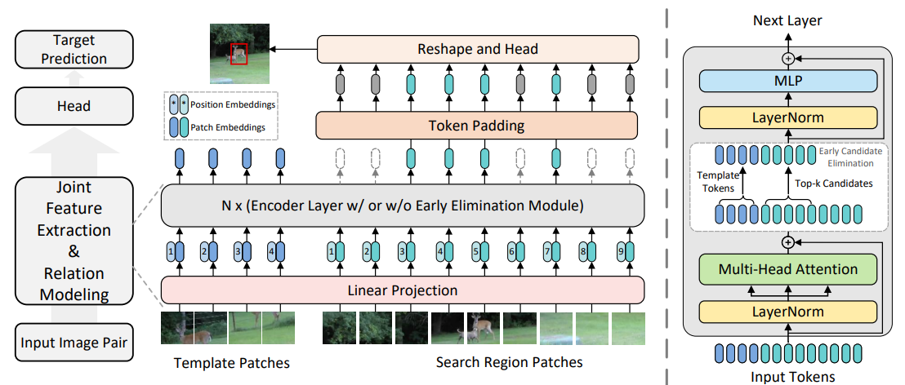
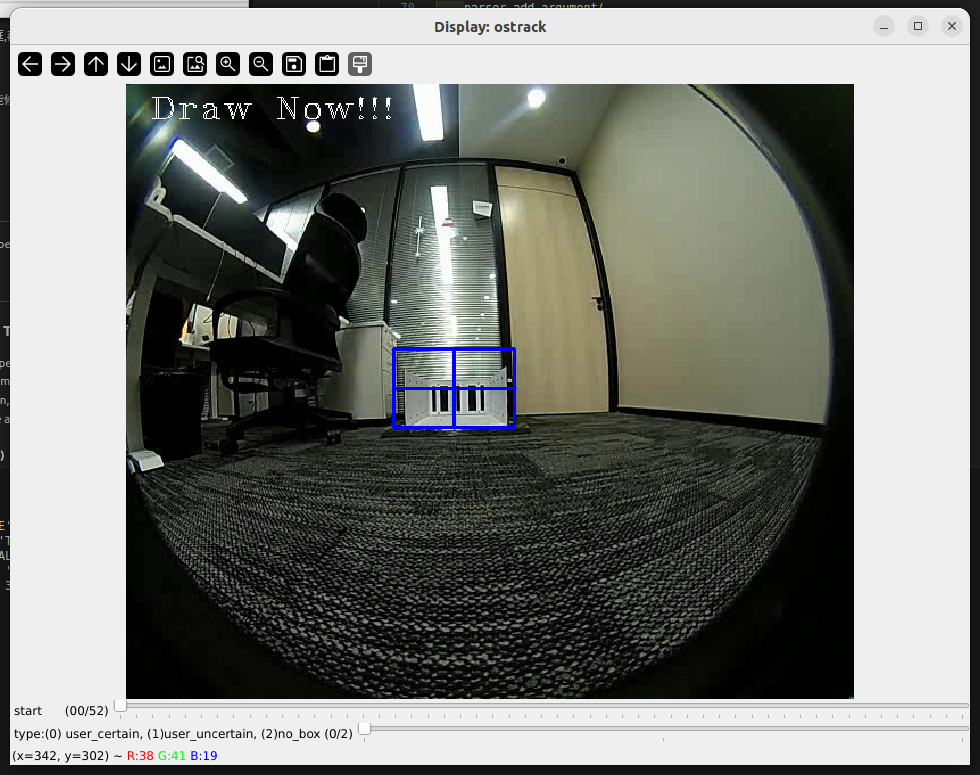
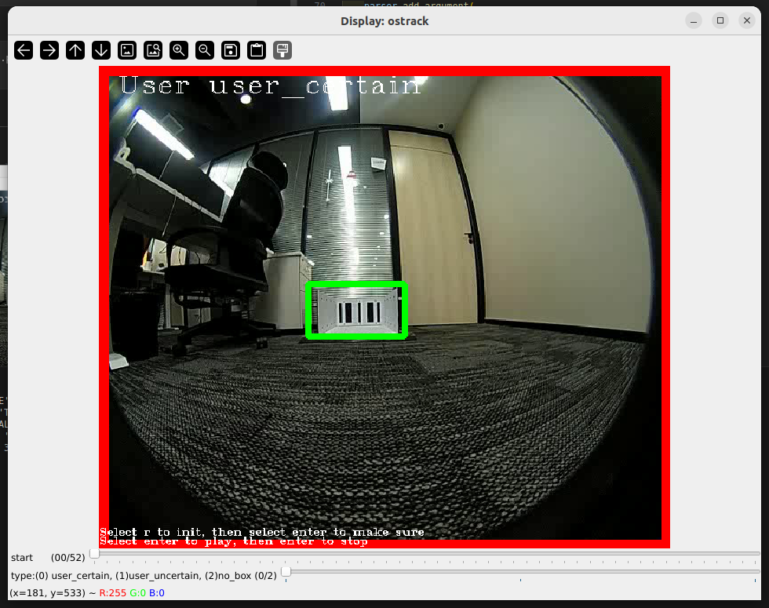
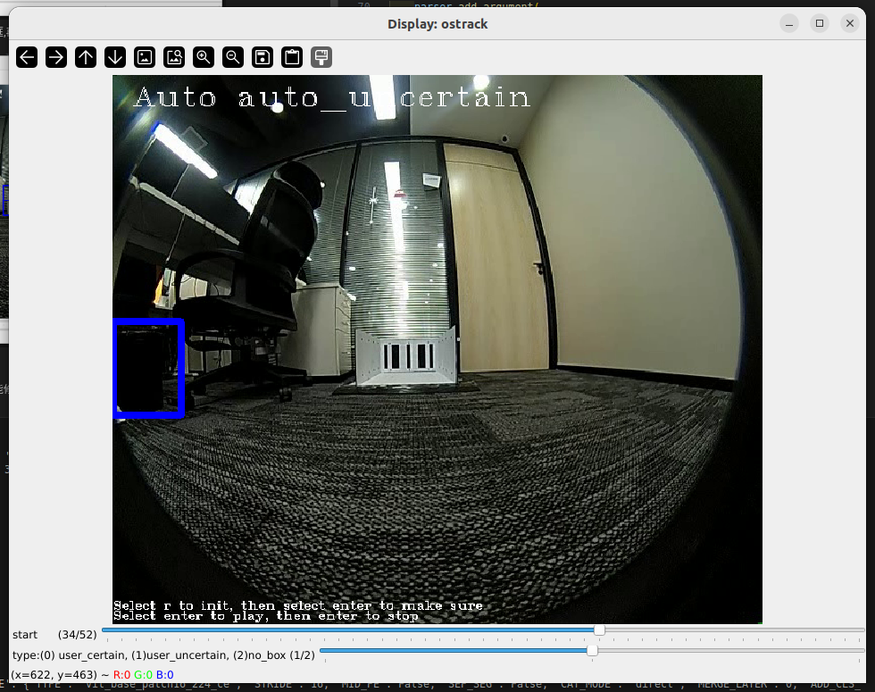
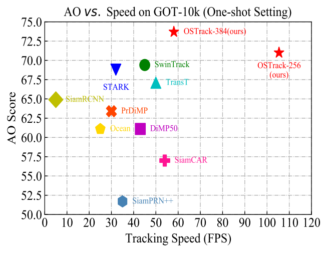

# 自动标注工具
The official implementation for the **ECCV 2022** paper [_Joint Feature Learning and Relation Modeling for Tracking: A One-Stream Framework_](https://arxiv.org/abs/2203.11991).

[[Models](https://drive.google.com/drive/folders/1ttafo0O5S9DXK2PX0YqPvPrQ-HWJjhSy?usp=sharing)][[Raw Results](https://drive.google.com/drive/folders/1TYU5flzZA1ap2SLdzlGRQDbObwMxCiaR?usp=sharing)][[Training logs](https://drive.google.com/drive/folders/1LUsGf9JRV0k-R3TA7UFBRlcic22M4uBp?usp=sharing)]

<!-- [](https://paperswithcode.com/sota/visual-object-tracking-on-lasot?p=joint-feature-learning-and-relation-modeling)

[](https://paperswithcode.com/sota/visual-object-tracking-on-got-10k?p=joint-feature-learning-and-relation-modeling)

[//]: # ([![PWC]&#40;https://img.shields.io/endpoint.svg?url=https://paperswithcode.com/badge/joint-feature-learning-and-relation-modeling/visual-object-tracking-on-trackingnet&#41;]&#40;https://paperswithcode.com/sota/visual-object-tracking-on-trackingnet?p=joint-feature-learning-and-relation-modeling&#41;)
[](https://paperswithcode.com/sota/visual-object-tracking-on-uav123?p=joint-feature-learning-and-relation-modeling)
 -->
<p align="center">
  
</p>
论文来自以上的内容

## 1、Install the environment安装环境
**Option1**: Use the Anaconda (CUDA 10.2)
```
conda create -n ostrack python=3.8
conda activate ostrack
bash install.sh
```

**Option2**: Use the Anaconda (CUDA 11.3)
```
conda env create -f ostrack_cuda113_env.yaml
```

**Option3**: Use the docker file（可选）

We provide the full docker file here.
## 2、网络参数的放置
确保在./output/checkpoints/train/ostrack文件夹下，有相应的参数文件

比如参数配置为vitb_384_mae_ce_32x4_ep300，

则有
./output/checkpoints/train/ostrackvitb_384_mae_ce_32x4_ep300/OSTrack_ep0300.pth.tar

本项目默认为vitb_384_mae_ce_32x4_ep300参数配置，OSTrack_ep0300.pth.tar
   ```
    -- output
        -- checkpoints
            -- train
              -- ostrackvitb_384_mae_ce_32x4_ep300
                  OSTrack_ep0300.pth.tar
   ```


## 3、准备数据文件
本工具每次只能检测一次，确保文件夹模式如下
比如，

   ```
    -- data
        1.jpg
        2.jpg
        3.jpg
        ...
   ```
## 4、运行工具
```
python detection_anno.py --imagedir 数据文件夹 --class_name 类名
```
   比如

```
python detection_anno.py --imagedir /home/lei/pj2/data/cam13 --class_name jizhan
```
## 5、工具规则
1、首次

  

拖动进度条选择画面，按下r画框,再按回车确认物体，然后自动推导




2、修改

选择任意画面，按r后修改，只能修改user到user之间的画面。

3、播放

### tip!!!


黄框为确认的物体，没有遮掩的



蓝框为不确认物体，有遮掩的
最外层有红框的话，则为用户标记

标签的选择，由最底下的滑块决定

选择任意画面，按回车播放

## 6、获取数据结果
在data文件夹下，可以发现有label/$CLASS_NAME.txt的结果

## Highlights

### :star2: New One-stream Tracking Framework
OSTrack is a simple, neat, high-performance **one-stream tracking framework** for joint feature learning and relational modeling based on self-attention operators.
Without any additional temporal information, OSTrack achieves SOTA performance on multiple benchmarks. OSTrack can serve as a strong baseline for further research.

| Tracker     | GOT-10K (AO) | LaSOT (AUC) | TrackingNet (AUC) | UAV123(AUC) |
|:-----------:|:------------:|:-----------:|:-----------------:|:-----------:|
| OSTrack-384 | 73.7         | 71.1        | 83.9              | 70.7        |
| OSTrack-256 | 71.0         | 69.1        | 83.1              | 68.3        |


### :star2: Good performance-speed trade-off

[//]: # (![speed_vs_performance]&#40;https://github.com/botaoye/OSTrack/blob/main/assets/speed_vs_performance.png&#41;)
<p align="center">
  
</p>


